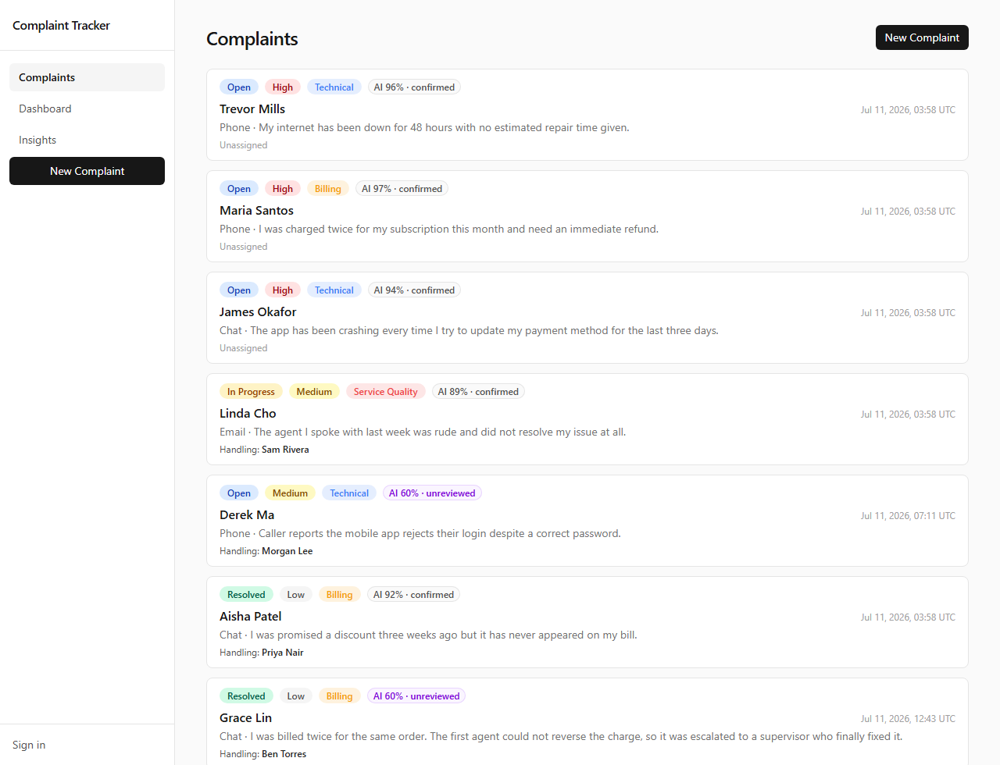
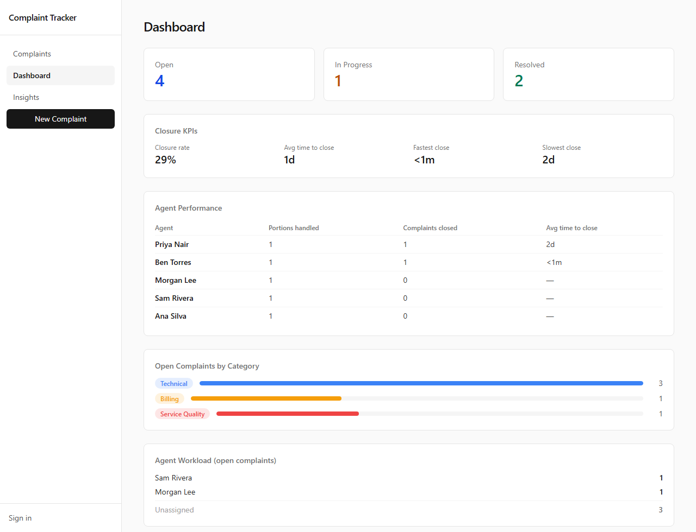

# Call Center Complaint Tracker

A polished, demoable call-center complaint tracker with AI-powered tagging and prioritization.

**Live demo**: https://call-center-agent-app.vercel.app





## 30-second demo script

1. Open the live URL — five seeded complaints load with status, priority, and AI category badges.
2. Click **New Complaint**, fill in a caller name and a description (e.g. "Customer says they were
   charged twice and wants an immediate refund"), pick a channel, and submit.
3. Land on the detail page — the AI has already tagged the category and urgency score.
4. Open **Dashboard** — the open count and priority queue reflect the new complaint.
5. Back on the detail page, change status to **In Progress** and save — refresh to confirm it persists.

## Stack

| Layer | Choice |
|---|---|
| Framework | Next.js 15 (App Router, React 19, Server Actions) |
| Language | TypeScript strict |
| Styles | Tailwind CSS v4 |
| Database | Supabase (Postgres + RLS) |
| AI | OpenAI (gpt-4o-mini) with a deterministic rule-based fallback |
| Deploy | Vercel |

## How it works

- **Complaints** are the core record: caller info, channel, description, status, priority.
- On submit, `/api/complaints` calls the classifier in [lib/ai/classify.ts](lib/ai/classify.ts) to
  auto-assign a category and urgency score. If `OPENAI_API_KEY` isn't set (or the call fails), a
  rule-based keyword/heuristic classifier fills in instead — the complaint is always tagged.
- Each complaint tracks its **handling agent** — set when the call is taken or assigned/reassigned
  from the detail page. Every status change, category override, assignment, and AI tag writes a
  row to `audit_logs` **naming the acting agent**, shown as a timeline on the detail page.
- The dashboard aggregates live counts, a category breakdown, and a top-5 urgency queue.

See [docs/](docs/) for the full PRD, architecture, data model, and sprint plan this was built from.

## Local setup

```bash
npm install
cp .env.example .env.local   # fill in Supabase keys (see below); OPENAI_API_KEY optional
npm run dev
```

Open http://localhost:3000.

### Database

Apply the migrations in `supabase/migrations/` **in order** to your Supabase project (SQL editor,
or `supabase db push`) before running the app:

1. `0001_init.sql` — creates `categories`, `complaints`, `audit_logs`, and seed rows
2. `0002_lock_down.sql` — replaces the permissive v1 policies with owner-scoped RLS

## Auth & data isolation

- **No login needed for the demo** — anonymous visitors get the full app against a shared public
  demo pool (the seed data plus anything submitted without signing in).
- **Sign up for a private workspace** (`/login`) — authenticated agents see only their own
  complaints (`auth.uid() = user_id` RLS on every table); the demo pool and other agents' data
  are invisible to them, and vice versa.
- `audit_logs` is insert-only (immutable trail) and `categories` is read-only shared taxonomy —
  enforced by RLS, not just application code.

## Notes

- Secrets (`SUPABASE_SERVICE_ROLE_KEY`, `OPENAI_API_KEY`) are only ever read in `app/api/` routes,
  never in client components. The browser only sees the public Supabase URL + publishable key.
